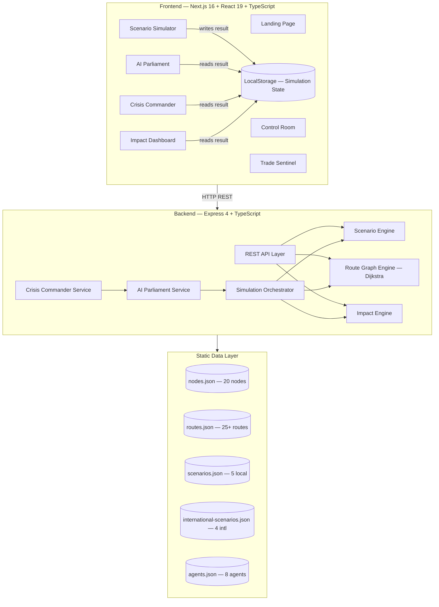

<div align="center">

# AEGIS: Bharat Nerves

### A Self-Healing Digital Nervous System for Trade, Logistics & Disaster Resilience

[](https://nextjs.org)
[](https://typescriptlang.org)
[](https://expressjs.com)
[](https://leafletjs.com)
[](LICENSE)

**[Judge Guide →](docs/JUDGE_GUIDE.md)** &nbsp;|&nbsp; **[User Guide →](docs/USER_GUIDE.md)** &nbsp;|&nbsp; **[Architecture →](docs/ARCHITECTURE.md)** &nbsp;|&nbsp; **[API Reference →](docs/API_REFERENCE.md)**

</div>

---

## The Problem

India's critical infrastructure — ports, highways, logistics hubs, hospitals, and supply depots — operates in silos. When a disaster strikes (cyclone, flood, port shutdown), there is no unified system that can:

- **See the full impact** across trade corridors, logistics networks, and civilian supply chains simultaneously
- **Compute alternative routes** before roads and ports are declared unusable
- **Quantify losses** in economic, carbon, and humanitarian terms in real time
- **Surface coordinated recommendations** across multiple government and operational domains
- **Issue an executable crisis plan** that field commanders can act on immediately

The result: delayed decisions, duplicated efforts, and compounding economic and humanitarian losses.

---

## The Solution

**AEGIS** is a self-healing national intelligence platform that ingests a disaster scenario, runs it through a multi-stage simulation pipeline, and surfaces decision-ready intelligence across five specialized command modules — all in a single unified workflow.

```
Disaster Scenario
      ↓
Scenario Engine       resolves affected nodes & routes
      ↓
Route Graph Engine    Dijkstra shortest-path + disruption-aware recovery routing
      ↓
Impact Engine         economic loss · carbon delta · population affected · resilience score
      ↓
AI Parliament         8-agent multi-domain deliberation → weighted consensus
      ↓
Crisis Commander      executive action plan + resource deployment map
      ↓
Decision Dashboard    live KPIs · state-level heatmap · recovery timeline
```

---

## Key Features

| Module | Capability |
|---|---|
| **National Control Room** | Real-time system health, corridor status, active alerts, digital twin map |
| **Digital Twin Map** | Live infrastructure visualization on OpenStreetMap — ports, highways, hubs, hospitals |
| **Scenario Simulator** | 5 local + 4 international disaster scenarios with configurable intensity and radius |
| **Route Graph Engine** | In-memory bidirectional graph with Dijkstra shortest-path and disruption-aware recovery routing |
| **Simulation Orchestration** | Single API call chains scenario → route recovery → impact calculation in one deterministic pipeline |
| **Economic Impact Engine** | GDP loss, trade disruption, sector-by-sector breakdown, revenue recovery timeline |
| **Carbon Impact Engine** | Freight rerouting emissions delta and carbon cost quantification |
| **AI Parliament** | 8 specialized agents (Infrastructure, Environment, Humanitarian, Economic, Logistics, Risk, Technology, Policy) deliberate and reach a weighted consensus score |
| **Crisis Commander** | Phased executive response plan with resource deployment map and operational readiness indicators |
| **Impact Dashboard** | State-level impact heatmap, KPI strip, recovery comparison charts, resilience scoring |
| **Unified State Persistence** | Simulation results flow across all five intelligence modules via browser-local state — no login required |
| **Trade Sentinel** | Trade corridor monitoring, shipment tracking, port capacity analytics, route risk scoring |

---

## MVP Workflow

```
┌────────────────────────────────────────────────────────────┐
│  USER                                                       │
│  → Opens Scenario Simulator                                │
│  → Selects: Cyclone Fani | Severity: High | Radius: 80km  │
│  → Clicks: Run Simulation                                  │
└────────────────────┬───────────────────────────────────────┘
                     │
                     ▼
┌────────────────────────────────────────────────────────────┐
│  BACKEND: POST /api/simulations/run                        │
│  ┌─────────────────────────────────────────────────────┐  │
│  │ 1. Scenario Engine                                  │  │
│  │    Loads scenario → resolves 6 affected nodes       │  │
│  │    Marks 4 routes as disrupted                      │  │
│  └──────────────────────┬──────────────────────────────┘  │
│                         │                                  │
│  ┌──────────────────────▼──────────────────────────────┐  │
│  │ 2. Route Graph Engine (Dijkstra)                    │  │
│  │    Builds bidirectional graph from 20 nodes         │  │
│  │    Computes 3 alternative recovery corridors        │  │
│  └──────────────────────┬──────────────────────────────┘  │
│                         │                                  │
│  ┌──────────────────────▼──────────────────────────────┐  │
│  │ 3. Impact Engine                                    │  │
│  │    Economic loss: ₹4,200 Cr                        │  │
│  │    Population affected: 2.3M                        │  │
│  │    Carbon delta: +18,400 tCO₂                      │  │
│  │    Resilience score: 62/100                         │  │
│  └──────────────────────┬──────────────────────────────┘  │
└───────────────────────────────────────────────────────────-┘
                     │
         Results stored in browser state
                     │
         ┌───────────┴───────────┐
         ▼                       ▼
┌────────────────┐     ┌──────────────────────┐
│  AI Parliament │     │  Crisis Commander     │
│  8 agents read │     │  Generates phased     │
│  simulation    │     │  action plan from     │
│  → consensus   │     │  parliament output    │
└────────────────┘     └──────────────────────┘
         │                       │
         └───────────┬───────────┘
                     ▼
           ┌──────────────────┐
           │ Impact Dashboard │
           │ Maps · Charts    │
           │ Recovery Timeline│
           └──────────────────┘
```

---

## How to Navigate the Prototype

### Step 1 — Control Room
The command dashboard. Review active corridor alerts, system KPIs, and the Digital Twin Map showing all 20 infrastructure nodes across Odisha and eastern India.

### Step 2 — Scenario Simulator
Select a scenario (e.g., *Cyclone Fani*). Set intensity and affected radius. Click **Run Simulation**. Watch the pipeline execute: affected nodes turn red on the map, recovery routes are computed, impact metrics appear instantly.

### Step 3 — AI Parliament
Navigate here after simulation. Eight domain experts (AI agents) present their position on the crisis. Each agent has a different priority weighting. The platform surfaces a consensus recommendation and priority action list.

### Step 4 — Crisis Commander
The executive command layer. A phased response plan (Immediate / Short-term / Long-term) is generated from the simulation and parliament output. Resource deployment is shown on the map.

### Step 5 — Impact Dashboard
Economic, carbon, and population impact metrics broken down by state and sector. Recovery comparison chart shows baseline vs. disrupted vs. recovery-routed trajectories.

---

## Technical Architecture



---

## Repository Structure

```
AEGIS-Bharat-Nerves/
├── frontend/
│   ├── src/
│   │   ├── app/
│   │   │   ├── (public)/page.tsx          # Landing page
│   │   │   └── (app)/
│   │   │       ├── control-room/
│   │   │       ├── scenario-simulator/
│   │   │       ├── trade-sentinel/
│   │   │       ├── ai-parliament/
│   │   │       ├── crisis-commander/
│   │   │       ├── impact-dashboard/
│   │   │       ├── reports/
│   │   │       ├── resources/
│   │   │       └── settings/
│   │   ├── components/
│   │   │   ├── layout/                    # AppShell, Sidebar, Topbar
│   │   │   ├── dashboard/                 # Control Room panels
│   │   │   ├── maps/                      # AegisMap, NodeMarker, RouteLayer
│   │   │   ├── scenario/                  # Simulator UI
│   │   │   ├── agents/                    # AI Parliament cards
│   │   │   ├── commander/                 # Crisis Commander panels
│   │   │   ├── landing/                   # Landing page sections
│   │   │   └── shared/                    # MetricCard, AlertCard, DataTable…
│   │   ├── data/                          # Frontend TypeScript data files
│   │   └── lib/
│   │       └── simulation-store.ts        # Global state (localStorage)
│   └── package.json
│
├── backend/
│   ├── src/
│   │   ├── routes/                        # Express route handlers
│   │   ├── services/
│   │   │   ├── scenario-engine/
│   │   │   ├── route-graph/               # Dijkstra implementation
│   │   │   ├── impact-engine/
│   │   │   ├── simulation/                # Orchestrator
│   │   │   ├── ai-parliament/
│   │   │   └── crisis-commander/
│   │   └── data/                          # Static JSON datasets
│   └── package.json
│
├── docs/
│   ├── JUDGE_GUIDE.md
│   ├── USER_GUIDE.md
│   ├── MVP_CAPABILITIES.md
│   ├── SYSTEM_FLOW.md
│   ├── ARCHITECTURE.md
│   └── API_REFERENCE.md
│
└── README.md
```

---

## API Overview

Base URL: `http://localhost:4000` (local) or the deployed backend URL.

| Method | Endpoint | Description |
|---|---|---|
| `GET` | `/api/health` | Health check |
| `GET` | `/api/nodes` | All infrastructure nodes |
| `GET` | `/api/routes` | All corridor routes |
| `GET` | `/api/scenarios` | Local disaster scenarios |
| `GET` | `/api/scenarios/international` | International scenarios |
| `POST` | `/api/scenarios/:id/run` | Execute scenario engine |
| `POST` | `/api/route-graph/shortest-path` | Dijkstra shortest path |
| `POST` | `/api/route-graph/recover` | Recovery routing around disruptions |
| `POST` | `/api/impact/calculate` | Calculate all impact dimensions |
| `POST` | `/api/simulations/run` | Full orchestrated pipeline |
| `POST` | `/api/ai-parliament/session` | Run multi-agent deliberation |
| `POST` | `/api/crisis-commander/plan` | Generate executive response plan |

Full reference: **[docs/API_REFERENCE.md](docs/API_REFERENCE.md)**

---

## Local Development

### Prerequisites
- Node.js 18+
- npm

### Backend
```bash
cd backend
npm install
cp .env.example .env
# .env: PORT=4000  NODE_ENV=development  FRONTEND_ORIGIN=http://localhost:3000
npm run dev
# → http://localhost:4000
```

### Frontend
```bash
cd frontend
npm install
echo "NEXT_PUBLIC_API_URL=http://localhost:4000" > .env.local
npm run dev
# → http://localhost:3000
```

---

## Technology Stack

### Frontend
| Technology | Version | Purpose |
|---|---|---|
| Next.js | 16.2.9 | App Router, SSR, static generation |
| React | 19.2.7 | Component model |
| TypeScript | 6.0.3 | Type safety |
| Tailwind CSS | 3.4.17 | Styling |
| Leaflet + React-Leaflet | 1.9.4 / 5.0.0 | Interactive maps |
| Recharts | 3.8.1 | Charts and data visualization |
| Lucide React | 1.18.0 | Icon system |

### Backend
| Technology | Version | Purpose |
|---|---|---|
| Node.js | 18+ | Runtime |
| Express | 4.19.2 | REST API |
| TypeScript | 5.4.5 | Type safety |
| Dijkstra (custom) | — | Route graph algorithm |

---

## Future Scope

The following capabilities are planned for post-hackathon development:

- **LLM integration** — Replace the rule-based AI Parliament with Gemini / GPT-4o via LangGraph multi-agent orchestration
- **Live data feeds** — IMD weather API, port AIS vessel tracking, NHAI road sensors
- **Database layer** — PostgreSQL + PostGIS for spatial queries and historical replay
- **Satellite integration** — SAR imagery for real-time damage assessment
- **Predictive analytics** — ML-based impact forecasting using weather-adjusted routing signals
- **Authentication** — Role-based access (Field Commander / Analyst / Observer)
- **Government data integration** — NDMA, Ministry of Shipping, NITI Aayog real-time datasets
- **Mobile companion** — React Native field commander app

---

## Team

| Name | Role |
|---|---|
| Paranjay Soni | Full-Stack Engineer & Product Lead |

---

<div align="center">

Built for national resilience &nbsp;·&nbsp; Hackathon 2024 &nbsp;·&nbsp; MIT License

</div>
