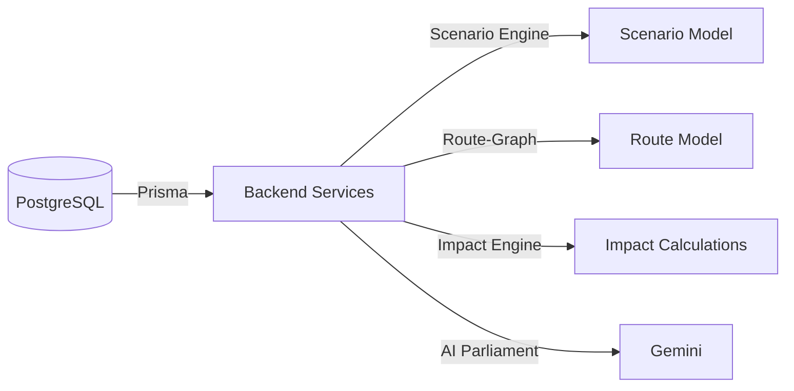

# DATABASE.md

## Prisma Schema Overview
The database schema lives in `backend/prisma/schema.prisma`. It defines four primary models that drive the simulation:

```prisma
model Node {
  id           String   @id
  name         String
  type         String
  latitude     Float
  longitude    Float
  district     String
  state        String
  status       String
  importance   String
  capacity     Float
  capacityUnit String
  description  String
  tags         String[]
}

model Route {
  id                String   @id
  name              String
  sourceNodeId      String
  destinationNodeId String
  distanceKm        Float
  travelTimeMinutes Float
  routeType         String
  highway           String?
  status            String
  corridor          String
  riskLevel         String
  baselineCarbonKg  Float
  baselineCostInr   Float
  description       String
}

model Scenario {
  id                       String   @id
  name                     String
  category                 String
  severity                 String
  region                   String
  country                  String
  description              String
  affectedNodeIds          String[]
  affectedRouteIds         String[]
  blockedRouteIds          String[]
  expectedDelayHours       Float
  expectedEconomicLossCr    Float
  expectedCarbonIncrease    Float
  expectedPopAffected      Float
  expectedResilienceBefore Float
  expectedResilienceAfter  Float
  expectedRecoveryDays     Float
  tags                     String[]
  stormPath                Json?
  // Optional fields for International scenarios
  globalRelevance          String?
  tradeImpactUsd           Float?
  geopoliticalContext      String?
}

model RiskConfig {
  id       String @id @default("global")
  critical Int
  high     Int
  medium   Int
}
```

### Relationships & Usage
- **Node** and **Route** are static infrastructure data used by the **Route‑Graph** service for pathfinding.
- **Scenario** contains deterministic inputs for the **Scenario Engine**.
- **RiskConfig** provides global weighting for risk calculations used across the impact engine.
- All models are accessed via Prisma generated client (`prismaClient.<model>.findMany`, `findUnique`, etc.) in services under `backend/src/services/*`.

### Data Flow Diagram


### Status
- **Implemented / Live** – All models are present and used by the code.
- **Not Verified** – No migrations beyond initial schema; schema matches code expectations.
