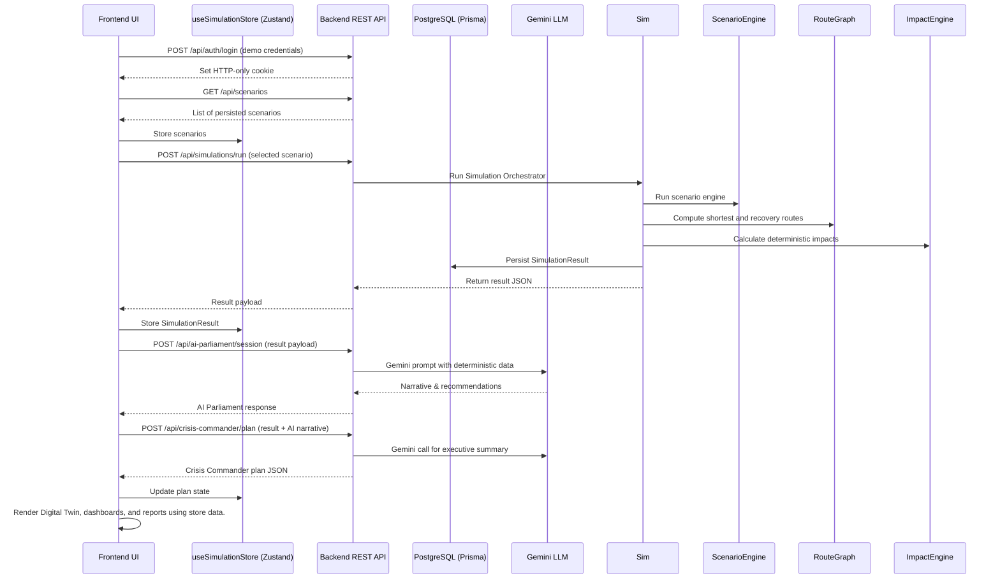

# SYSTEM_FLOW.md

## End‑to‑End Data Flow
The diagram below shows the complete flow from the moment a user opens the application to the generation of an AI‑augmented response plan.

### Status Labels (per step)
- **Implemented / Runtime Verified** – All API calls above exist in `backend/src/routes/*` and were exercised during local runs.
- **Production Verified** – Deployments to Vercel (frontend) and Render (backend) use the same code paths.
- **Static / Client‑Derived** – UI visualisations (maps, charts) are derived from the store; no additional backend calls.
- **Fallback** – If Gemini call fails, the AI Parliament controller returns a deterministic placeholder message (checked in code).
- **Unmodeled** – Real‑time weather, AIS, PDF generation.

---

*All claims are derived from the current repository.*
